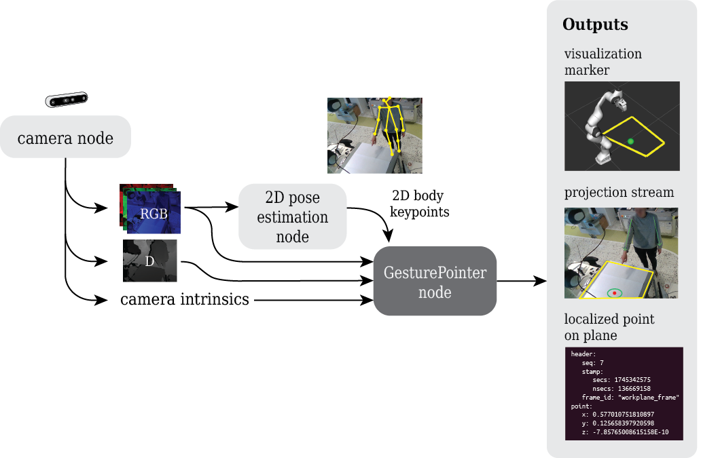

This is the documentation for GesturePointer ROS module. The gesturing node uses RGB-D stream and pose estimation to localize and publish pointed targets as ROS topics.

<div style="position: relative; padding-bottom: 56.25%; height: 0; overflow: hidden; max-width: 100%;">
  <iframe 
    src="https://www.youtube.com/embed/6pz6xVdxndg?si=_xCGAT41A2rG3sZX" 
    title="YouTube video player" 
    style="position: absolute; top: 0; left: 0; width: 100%; height: 100%;" 
    frameborder="0" 
    allow="accelerometer; autoplay; clipboard-write; encrypted-media; gyroscope; picture-in-picture; web-share" 
    referrerpolicy="strict-origin-when-cross-origin" 
    allowfullscreen>
  </iframe>
</div>

The tool is released for both ROS1 (Noetic) and ROS2 (Humble) distributions, and testing has been performed using Ubuntu Focal Fossa 20.04 and Jammy Jellyfish 22.04 distributions. The modules are targeted for Intel RealSense D400 product family.  

# Overview

Two ROS nodes need to be launched in prior to the gesturing node itself: a camera node and a 2D pose estimation node.
The inputs and outputs are presented in the below diagram. 




The camera node has to publish three topics: 
- RGB stream
- aligned depth-to-color (D) stream
- camera intrinsics

The RGB stream is directly used by a 2D pose estimation node, which detects human body keypoints as 2D image coordinates. The keypoints are subscribed by Gesturing node, which utilizes the keypoints for shoulders and wrists to detect the pointed targets.

The gesturing node has an instance of `CameraSubscriber` class, which subscribes RGB-D stream and camera intrinsics. The class interface includes getter functions for the latest RGB and depth frames, and functions for coordinate deprojection (from 2D to 3D) and projection (from 3D to 2D). 

The gesturing node outputs three different ROS topics: 
- a localized point on plane
- a projection stream
- visualization markers. 

The projection stream shows the borders of the user-defined workspace and visual cues for the localized gestures. The stream can be used to direct the gestures better and troubleshoot possible issues with gesturing. The localized point consists of a timestamp and the pointed coordinate with respect to the camera coordinate frame or workplane frame. The visualization markers for `RViz` create spherical points for the localized points on plane.

# More information / cites

[Pre-print of Ro-Man 2025 conference paper](https://doi.org/10.48550/arXiv.2506.22116):

```bibtex
@article{sassali-and-pieters-2025,
    author = {Sassali, N. and Pieters, R.},
    title = {Evaluating Pointing Gestures in Human-Robot Collaboration},
    year = {2025},
    note = {Accepted by the 2025 34th IEEE International Conference on Robot and Human Interactive Communication (RO-MAN). Preprint.},
    url = {https://doi.org/10.48550/arXiv.2506.22116}
}
```

The modules were developed as part of [M.Sc. thesis](https://urn.fi/URN:NBN:fi:tuni-202505195761), in Cognitive Robotics research group at Tampere University. The thesis provides more information about the theory behind the modules. 

```bibtex
@mastersthesis{sassali_msc,
    author = {Sassali, Noora},
    copyright = {This publication is copyrighted. You may download, display and print it for Your own personal use. Commercial use is prohibited.},
    organization = {Faculty of Information Technology and Communication Sciences, Tampere University},
    title = {Pointing Gestures in Human-Robot Collaboration},
    year = {2025},
    url = {https://urn.fi/URN:NBN:fi:tuni-202505195761}
}
```
# Contact
Noora Sassali, [`@NMKsas`](https://github.com/NMKsas) 

**Note: The documentation is still a work in progress.**
